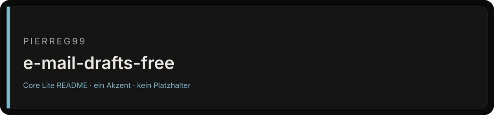
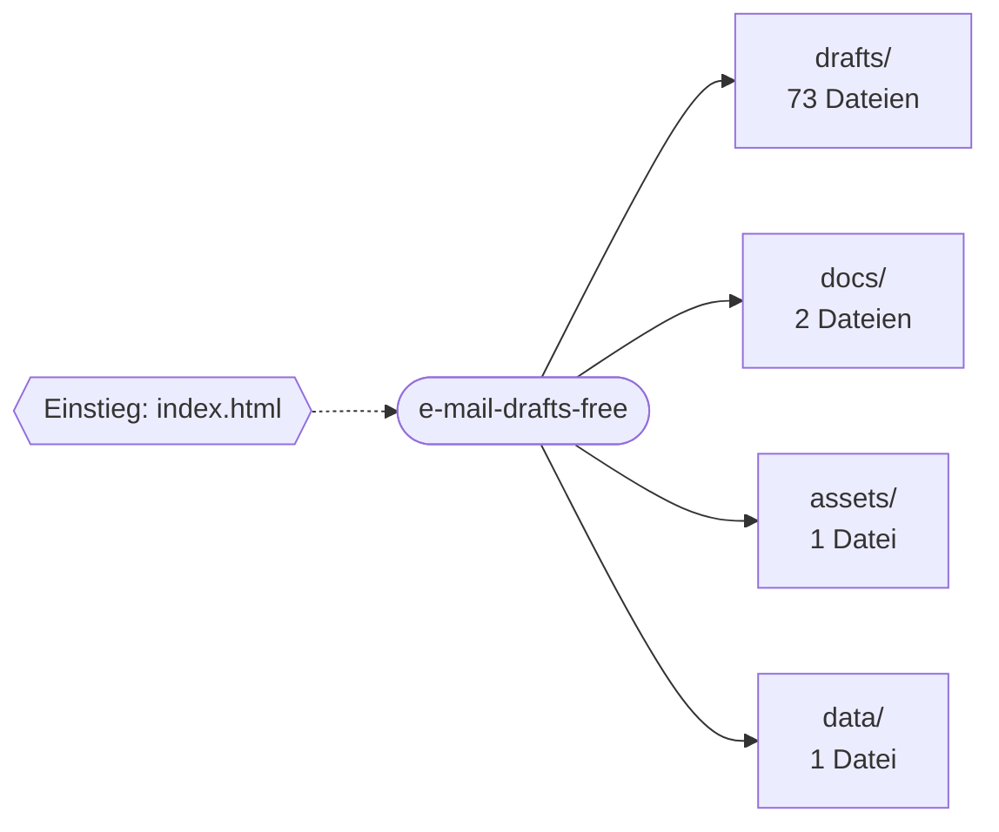

<div align="center">



# Email drafts free

<p><strong>Anonymisierte E-Mail-Entwürfe für zwölf Alltagsfälle, jeweils auf Englisch, Deutsch und zweisprachig.</strong></p>
<p>


</p>
<p><a href="#schnellstart">Schnellstart</a> · <a href="#projektstruktur">Projektstruktur</a> · <a href="#english-summary">English</a></p>
</div>

<table>
<tr>
<td width="58%" valign="top">

### Bestand

Keine Beschreibung im Repo-Metadatum. Dieses README erfindet deshalb keine Funktionen, Releases oder Laufzeiten.

Der Default-Branch `main` ist die Fläche, die zählt. Was nicht in diesem Baum liegt, ist kein Feature dieses Repos.

</td>
<td width="42%" valign="top">

### Fakten

| Feld | Wert |
| --- | --- |
| Owner | Pierreg99 |
| Branch | `main` |
| Sichtbarkeit | öffentlich |
| Sprache | JavaScript |
| Archiv | nein |

</td>
</tr>
</table>

---

## Inhaltsverzeichnis

- [Bestand und Fakten](#bestand)
- [Überblick](#überblick)
- [Features](#features)
- [Schnellstart](#schnellstart)
- [Architektur](#architektur)
- [Projektstruktur](#projektstruktur)
- [Dokumentation](#dokumentation)
- [Projektdetails](#projektdetails)
- [English summary](#english-summary)

## Überblick

Anonymisierte E-Mail-Entwürfe für zwölf Alltagsfälle, jeweils auf Englisch, Deutsch und zweisprachig.

| Merkmal | Wert |
| --- | --- |
| Sprachen | JavaScript (45%), CSS (28%), HTML (27%) |
| Dateien im Repository | 82 |
| Einstiegspunkte | `index.html` |

## Features

- 40 Markdown-Dokumente

## Schnellstart

```bash
git clone https://github.com/Pierreg99/e-mail-drafts-free.git
cd e-mail-drafts-free
```

Das Projekt benötigt keinen Build-Schritt: `index.html` direkt im Browser öffnen.

## Architektur

Übersicht der wichtigsten Verzeichnisse nach Anzahl der enthaltenen Dateien.



## Projektstruktur

```text
e-mail-drafts-free/
├── assets/  (1 Datei)
│   └── readme-banner.svg
├── data/  (1 Datei)
│   └── drafts.json
├── docs/  (2 Dateien)
│   ├── ANONYMIZATION.md
│   └── COACHING.md
├── drafts/  (73 Dateien)
│   ├── md/
│   ├── pdf/
│   └── INDEX.md
├── app.js
├── index.html
├── MANIFEST.json
├── README.md
└── styles.css
```

## Dokumentation

- [docs/ANONYMIZATION.md](docs/ANONYMIZATION.md)
- [docs/COACHING.md](docs/COACHING.md)

## Projektdetails

Der folgende Abschnitt übernimmt die bisherige Projektdokumentation.

Anonymized draft batches for twelve ordinary use cases. Each batch has English, German, and a bilingual version.

Open `index.html` locally, or enable GitHub Pages on `main` / root.

- Human artifact: `index.html`, `styles.css`, `app.js`
- Catalog: `data/drafts.json` (36 drafts)
- Policy: `docs/ANONYMIZATION.md`
- Coaching: `docs/COACHING.md`

Replace every `[TOKEN]` before sending. This repository contains no live mailbox data.

Edition: CryoSys Enterprise v3. Factory mode: dense.
Draft texts: `drafts/INDEX.md` (36 markdown files and matching text PDFs). Still anonymized.

## English summary

Anonymized email draft batches for twelve everyday use cases in English, German and a bilingual version.

Clone the repository and follow the commands in [Schnellstart](#schnellstart); the [project layout](#projektstruktur) shows where the code lives. Further documents are listed under [Dokumentation](#dokumentation).
